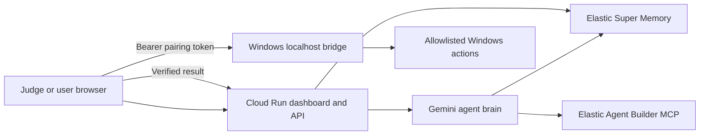

# Architecture

## Cloud Run Dashboard

Serves the web UI and server-side APIs. It owns Gemini and Elastic credentials. It can search memory and create plans without the Windows app.

## Gemini Agent

Retrieves at most the top relevant memories, builds a structured plan, and sanitizes the requested action against the registry. Unknown actions are blocked.

## Elastic Super Memory

Stores memories, chat summaries, actions, and failures in separate indices. Action/chat/failure documents are also represented in the memory index for unified recall.

## Elastic MCP

Google ADK performs authenticated tool discovery against Elastic Agent Builder MCP. The connection result is visible in compliance status.

## Browser-to-Bridge Split

A Cloud Run container cannot reach a user's `localhost`. The dashboard browser can. The browser sends the pairing token directly to `http://localhost:8787`, receives a verified result, and logs only the result to Cloud Run.

## Windows Bridge

The existing WinForms settings server is extended into a localhost-only bridge. It reuses the existing command registry, confirmation system, and automation service.

## Failure Semantics

- Offline bridge: plan is shown, action is not run, status is `demo_mode`.
- Rejected token: no action is run.
- Confirmation declined: status is `blocked`.
- Local execution error: status is `failed` and a failure memory is saved.
- Success is claimed only when the bridge returns success.
